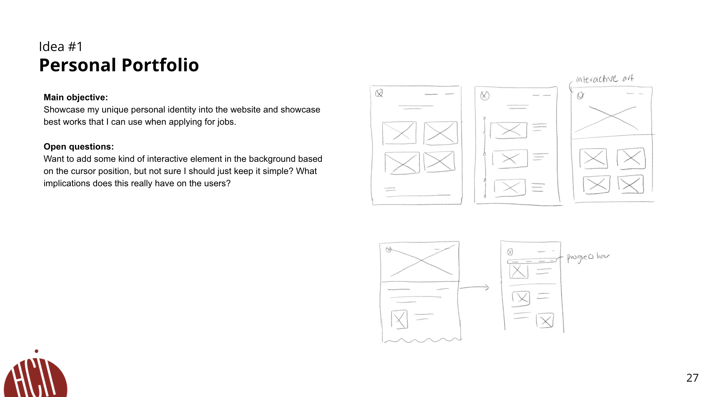
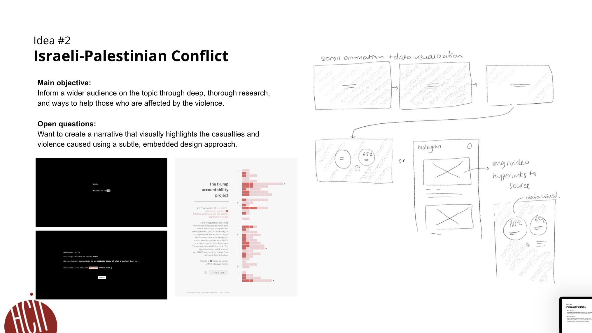
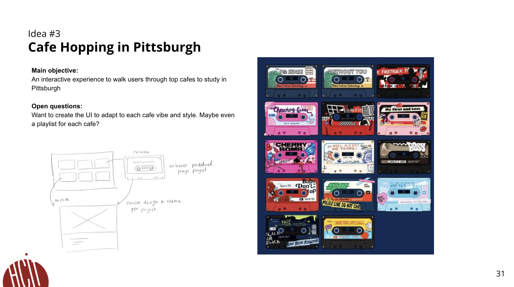

# FP1 - Proposal for Critique
## Idea Sketches
### Idea One

Personal Portfolio

A unique, branded portfolio that showcases my past projects to product designs recruiters in the b2c tech sector. 

My personal portfolio is going to be utlizing the unique aspects of digital websites in ways that animates components based on user interaction. The landing page will imitate the layout of my resume, and it will include a timeline with projects that appear aas users scroll. This way, recruiters are viewing my career achievements and projects in one interaction without having to download and view a separate resume. I’ll also be including progress bars to inform users on the amount of content that’s left based on the scroll position.

In terms of accessibility, I’ll create a simplified version on mobile so that the animation does not disrupt the user experience for people when they are on their phones. I’ll also adjust dimensions of the components based on screensize so that texts are legible, while coding using as many semantics as possible for the visually impaired. 

As users interact with my website, I want users to takeaway my key strength and how I can be a valuable asset to the company. In order to acheive this, I would have to analyze components in a very strategic way, for example by using gestalt principles, to give clear visual cues on the information I want to highlight.

### Idea Two

Israel-Palestine conflict

An interactive storytelling that informs users about the Israel-Palestine conflict by using data visualization to help them empathize beyond what numbers can do.

The Israel-Palestine conflict will take users through a series of screens to help them gain context of the conflict. It will then land them on an interactive data visualization page where numbers  are creatively and visually represented to get the intensity of the message across. Users will have moderate level of control on the website on select the specfici data they wish to learn more about. 

In terms of accessibility, I’ll need to create a data visualization that is not too complex for people with cognitive disability. There should be enough color contrast to ensure that information can be perceived clearly for people with visual disabilities.

### Idea Three

Cafe Hopping in Pittsburgh

An interactive gallery of cassette tapes that have unique designs based on the playlist of songs, specifically and manually curated based on popular cafes in Pittsburgh.

When user hovers over the cassette an exerpt of the song will play automatically and clicking it will take users to an informative page about the cafe with images and descriptions. It will also have reviews and locations that calculates the distance from their current location using API integration.

The website will have responsive design where the layout of cassette gallery changes in the number of columns displayed based on the viewport of devices. Since hover doesn’t work on mobiles, buttons will be used as visual cues to guide users on the controls they have.

## Feedback Summary
Through speed dating, my first idea—a personal portfolio—and my second—the Israeli-Palestinian conflict—received the most feedback. Out of the three project layouts I presented, the interactive resume generated the most positive reactions, as it broke away from the standard portfolio landing pages common among product designers. However, a risk noted was that projects are displayed one at a time as users scroll, which limits project visibility and is a trade-off I’d need to consider. The second idea also received considerable critique. Many people resonated with my motivation, but they raised concerns about the project’s timeframe, particularly the extensive research and fact-checking required against diverse sources, which would be time-consuming. Since this idea involves data visualization, they also suggested taking a more creative approach, making the visualizations contextually aligned with the narrative rather than relying solely on standard graphs and charts.

## Feedback Digestion
Based on the feedback I received, I've decided to create a personal portfolio with an interactive resume layout. This approach not only allows me to showcase my experience and skills but also opens up space for more experimental design choices. One area I’m particularly interested in exploring is the role of animation in enhancing user experience. I believe that incorporating subtle animations can make my portfolio feel more engaging and interactive, guiding the viewer’s attention naturally from one section to another.

One suggestion from a peer was to design the interactive resume as a component that could be embedded within my existing portfolio as a dedicated “resume” page. While this would integrate my code with a third-party platform, which is an interesting idea I hadn’t initially thought of, I’m inclined to focus on creating a standalone landing page instead. Using it as a landing page would allow me to deliver a more impactful first impression by presenting both my portfolio and resume in a unified format. This way, recruiters can experience my skills and style holistically, without needing to navigate away from the initial view.